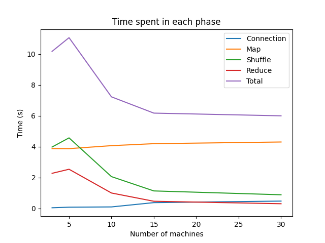

# SLR207

> Rapport du projet SLR207 à Télécom Paris - **Tristan Perrot**

Ce rapport permet de retracer tout mon travail effectué pour le projet SLR207. Il est découpé en plusieurs parties.
En premier temps, il y a la partie étape par étape en suivant le site web donnant les différentes instructions.
Ensuite, j'explique comment j'ai implémenté et comme lancer le code final.
Enfin, je fais une petite synthèse des résultats.

## Étape par étape

> Le travail suivant retrace les différentes étapes de programmation, les codes sources sont disponibles dans le dossier ``archive``.

### Étape 1

J'ai donc implémenté un logiciel en java qui compte le nombre d’occurrences des mots d’un fichier d’entrée de manière
non parallélisée. La structure de donnée la plus adaptée est l'**HashMap** car cela permet d'enregistrer des clefs
associées à des valeurs (ici les mots associés à leur occurrence).

* Lors du test sur **le code forestier de Mayotte** mon code a fonctionné du premier coup.
* En ce qui concerne **le code de la déontologie de la police nationale**, les 5 premiers mots qui ressemblent à des
  mots (hors articles, etc..) sont :
    1. police
    2. article
    3. nationale
    4. titre
    5. fonctionnaire
* En ce qui concerne **le code du domaine public fluvial**, les 5 premiers mots qui ressemblent à des mots (hors
  articles, etc..) sont :
    1. article
    2. bateau
    3. tribunal
    4. bureau
    5. navigation
* En ce qui concerne **le code de la santé publique**, les 5 premiers mots qui ressemblent à des mots (hors articles,
  etc..) sont :
    1. article
    2. santé
    3. sont
    4. directeur
    5. conditions
* Pour l'extrait de page internet, j'ai obtenu ces données :
  * Durée de lecture et de séparation : 4.039s
  * Durée de comptage : 5.271s
  * Durée de tri et d'affichage des 50 premiers mots : 6.809s

### Étape 2

Pour l'étape 2, j'ai utilisé l'ordinateur **tp-1a201-12** (tp-1a201-12.enst.fr).
Pour trouver son nom à l'aide d'une commande, il faut écrire :

```bash
hostname -f
```

> Le -f permet d'avoir le nom complet (avec le nom de domaine).

Sur les ordinateurs de l'école, je crois que cela est écrit un peu partout.

Pour trouver les addresses IP des ordinateurs de l'école, il faut utiliser la commande :

```bash
ifconfig
```

Pour obtenir les adresses IP en ligne de commande à partir du nom d'un ordinateur, il faut utiliser la commande :

```bash
host <nom de l ordinateur>
```

Pour obtenir les noms associés en ligne de commande à partir d'une adresse IP, il faut utiliser la commande :

```bash
host <adresse IP>
```

Les appels à la fonction ping avec comme argument le court nom, le nom long ou bien l'adresse IP fonctionnent très bien.

Pour lancer un calcul en ligne de commande, il est possible de faire comme cela :

```bash
echo $((2 + 3))
```

> Par ailleurs, cette commande permet d'avoir le résultat d'un calcul avec un seul appuie sur la touche entrée.

Pour lancer ce calcul à distance, nous pouvons procéder à l'aide de *ssh* comme cela :

```bash
ssh tperrot-21@<nom de l ordinateur> echo $((2 + 3))
```

> Par ailleurs, cette commande permet d'avoir le résultat d'un calcul immédiatement après saisie du mot de passe.

Pour ne plus avoir à réutiliser à ce mot de passe, il suffit d'utiliser d'enregistrer sa clé publique sur l'ordinateur
distant. Pour cela, il faut utiliser la commande :

```bash
ssh-copy-id tperrot-21@<nom de l ordinateur>
```

### Étape 3

Pour connaître le chemin absolu de mon répertoire personnel, il faut utiliser la commande :

```bash
pwd
```

> Ici, le chemin absolu est : /cal/exterieurs/tperrot-21

Après création de fperso.txt, pour savoir où est stocké physiquement ce fichier (disque dur de l'ordinateur ou autre
part) il suffit d'utiliser cette commande :

```bash
df -h fperso.txt
```

> Ici, le fichier n'est pas stocké sur le disque dur de l'ordinateur. De plus, le '-h' permet d'avoir une taille lisible
> par un humain.

Cependant, les fichiers et dossiers du répertoire /tmp/ sont stockés sur le disque dur de l'ordinateur.

Maintenant, pour, à partir de A, transférer le fichier /tmp/local.txt sur B (dans /tmp/tperrot-21/local.txt) en
utilisant scp, il faut faire :

```bash
scp /tmp/tperrot-21/local.txt tperrot-21@<nom de l ordinateur>:/tmp/tperrot-21/local.txt
```

Cependant, pour, à partir de A, transférer le fichier de B (depuis /tmp/tperrot-21/local.txt) vers C (dans
/tmp/tperrot-21/local.txt) en utilisant scp, il faut faire :

```bash
scp tperrot-21@<nom de l ordinateur>:/tmp/tperrot-21/local.txt <nom de l ordinateur>:/tmp/tperrot-21/local.txt
```

### Étape 4

Pour exécuter à distance (depuis A sur la machine B) le slave.jar, il faut utiliser la commande :

```bash
ssh tperrot-21@<nom de l ordinateur> 'java -jar /tmp/tperrot-21/slave.jar'
```

### Étape 6

Lors de mon étape 6, étant donné le TimeOut d'attente de sortie standard et de sortie d'erreur. Le TimeOut peut-être 2
fois supérieur, car le programme va "attendre" une erreur même si la sortie standard fonctionne bien et n'est pas
terminée.

### Étape 7

Le programme ``DEPLOY`` lance les connexions de manière séquentielle. Pour attendre que le mkdir termine correctement,
j'utilise la fonction ``waitFor``.
De même, le programme lance les copies de manière séquentielle.

### Étape 8

Le programme ``CLEAN`` lance les commandes d'effacement de manière séquentielle.

### Étape 10

Lors de la création des dossiers, je récupère le code de sortie afin de vérifier la bonne création. L'envoie des copies
est séquentielle. Mais la phase de map ne l'est pas.

### Étape 11 - 12 - 13

À la fin de l'étape 11, je me suis rendu compte que malgré la facilité de passer par ssh, il fallait que toutes les
machines se connaissent entre elles, ce qui pouvait être très long sachant que nous sommes aussi limités par le nombre
de machines disponibles en ssh. Je décide donc d'adapter mon code et d'utiliser des sockets. Cela me permet de ne pas
avoir à passer par ssh et de pouvoir utiliser toutes les machines disponibles.

J'ai quand même fini avec les connexions ssh mais ça n'a pas pu fonctionner à la fin.

J'ai donc créé un serveur (le master) et les clients en socket sauf que j'utilisais encore des scp dans la phase
shuffle. Ce qui ne fonctionnait pas....

J'ai donc récréé un dossier pour repartir avec mes machines qui deviennent des serveurs et le master un client de tous
les serveurs. Après de longue réflexion de comment gérer tout cela, j'ai enfin réussi !

> **stepByStep, serv_ssh, serv_v0 directories are deprecated and will certainly not work**

## Le code

### Idée pour les sockets

> Ici, je mets un léger paragraphe concernant une idée que j'ai eue, mais qui a été vite abandonnée

* DEPLOY : Envoi du slave.jar et du fichier machines.txt (en créant le dossier sur l'ordinateur master comme ça il n'y a besoin que d'un seul scp)
* SLAVE : Plusieurs modes, mais le mode 10 est l'initialisation des sockets. Ainsi, il faut que chaque machine crée un socket serveur et attende une connexion. Ensuite, quitte à utiliser la fonction ``isServerSocketOpen(String host, int port)``, le master envoie une demande de connexion en tant que client à chaque machine et récupère ainsi une liste de serveur. Ensuite, il dit à chaque serveur de se connecter à tous les autres serveurs (par message socket). Ainsi, chaque serveur est connecté à tous les autres serveurs.

### Idée finale

Finalement cela ne marche mais, du coup, j'ai trouvé un moyen et cela marche.

Chaque machine est un serveur et le master est un client de tous les serveurs. Ainsi, le master peut envoyer des messages à tous les serveurs et les serveurs peuvent envoyer des messages au master. Il n'y a plus de mode et ainsi les requêtes sont envoyées dans le sens ou chaque SLAVE doit effectuer une fonction.

Cependant, lors de la phase shuffle, les mots ""repassent"" par le master ce qui peut être un peu lourd en termes de nombre de messages. Pour éviter tout blocage, j'ai dû créer un thread lors de la phase shuffle pour envoyer et recevoir les messages en même temps.

Or, dans ma dernière version, j'ai réussi à coder un réseau complet de machines qui communiquent par **socket**. Ainsi, toutes les machines (lors de la phase shuffle) peuvent communiquer entre elles par le biais de socket.
Pour cela, il fallait vraiment faire attention à bien utiliser des **threads** et des fonctions ``synchronized`` pour ne pas bloquer le programme.


### Procédure de lancement

Pour lancer le programme, il faut lancer le programme java ``CLEAN`` afin de supprimer les dossiers temporaires.
Puis, il faut lancer le programme java ``DEPLOY`` qui permet d'envoyer des fichiers sur les machines (le code ``SLAVE``, le fichier machines.txt, ainsi que des splits créés par ce même programme, lorsque le programme est en mode test)
Enfin, le programme java ``MASTER`` permet de lancer le programme MapReduce.

> Il est possible de lancer directement les programmes ``SLAVE`` depuis le ``DEPLOY`` en activant le booléen ``autoLaunch`` dans le code. Même si nous ne verrons pas ce qu'il s'est passé exactement sur machine.
> Cependant, étant donné que le deploy kill tout processus ouvert sur le port 8888 avant de lancer les slaves, cela fonctionne bien.

Pour tester tous les résultats, il faut lancer le programme ``TEST`` qui va comparer les résultats obtenus avec les résultats attendus. Cela peut être extrêmement long et à ne pas utiliser pour les gros fichiers !!

### Configurations

Pour obtenir des machines, il faut exécuter le script bash suivant :

```bash
$ bash ./utils/getMachines.sh <nbMachines>
```

Ici, il y a plusieurs booléens à écrire afin d'obtenir les meilleurs résultats

* ``DEPLOY.autoLaunch`` : Permet de lancer automatiquement les programmes ``SLAVE`` depuis le programme ``DEPLOY``. Cependant, cela ne permet pas de voir ce qu'il se passe sur la machine et ne pas pouvoir l'arrêter si elle plante.
  * Ici en mode ``true``. 
  * **Attention**, s'il est en mode ``false`` il faut lancer les ``SLAVE`` manuellement avec cette commande : ``java -jar /tmp/tperrot-21/SLAVE.jar``.
* ``isTest`` : Présent dans ``DEPLOY`` et ``SLAVE``, cela permet de dire que ce sont les fichiers textes présents sur la machine qui vont être utilisés.
  * Ici en mode ``true``.
* ``SLAVE.verbose`` : Permet d'afficher les messages de la machine.
  * Ici en mode ``false`` pour optimiser les résultats

J'ai aussi fait un mode pour l'analyse de gros fichiers, pour cela, il faut :

* ``isTest`` : ``false``
* ``SLAVE.BIG_FILE_TO_PROCESS`` : Le chemin du fichier à analyser.
* ``SLAVE.linesPerMachine`` : Le nombre de lignes à analyser par machine.
* ``SLAVE.verbose`` : ``false`` pour gagner en temps.

> Cela est assez long et ne marche pas extrêmement bien

## Résultats

### Pour 100000 lignes du ``"/cal/commoncrawl/CC-MAIN-20230320083513-20230320113513-00000.warc.wet"``

> Tous les temps sont en secondes.

| Nombres de machines | Temps Connexion | Temps Map | Temps Shuffle | Temps Reduce | Temps Tot |
|:-------------------:|:---------------:|:---------:|:-------------:|:------------:|:---------:|
|          3          |      0.04       |   3.876   |     3.976     |    2.272     |  10.174   |
|          5          |      0.077      |   3.871   |     4.569     |    2.536     |  11.062   |
|         10          |      0.095      |   4.064   |     2.059     |    0.997     |   7.228   |
|         15          |      0.373      |   4.193   |     1.131     |    0.461     |   6.173   |
|         30          |      0.472      |   4.302   |     0.882     |    0.302     |   5.998   |

### Plot des résultats



## Conclusion

Pour conclure, j'ai réussi à implémenter l'algorithme MapReduce pour compte le nombre d'occurrences de mots dans un document à l'aide de sockets.
On peut voir évidemment que plus le nombre de machines est important, plus la connection est longue, mais plus vite l'algorithme tourne.
Par ailleurs, multiplier le nombre de machines par 10 divise par 2 le temps de travail !
Pour la partie ``sort`` j'ai commencé, mais je n'ai pas pu finir, ainsi, vous pourrez voir une partie des fonctions présente dans le code.